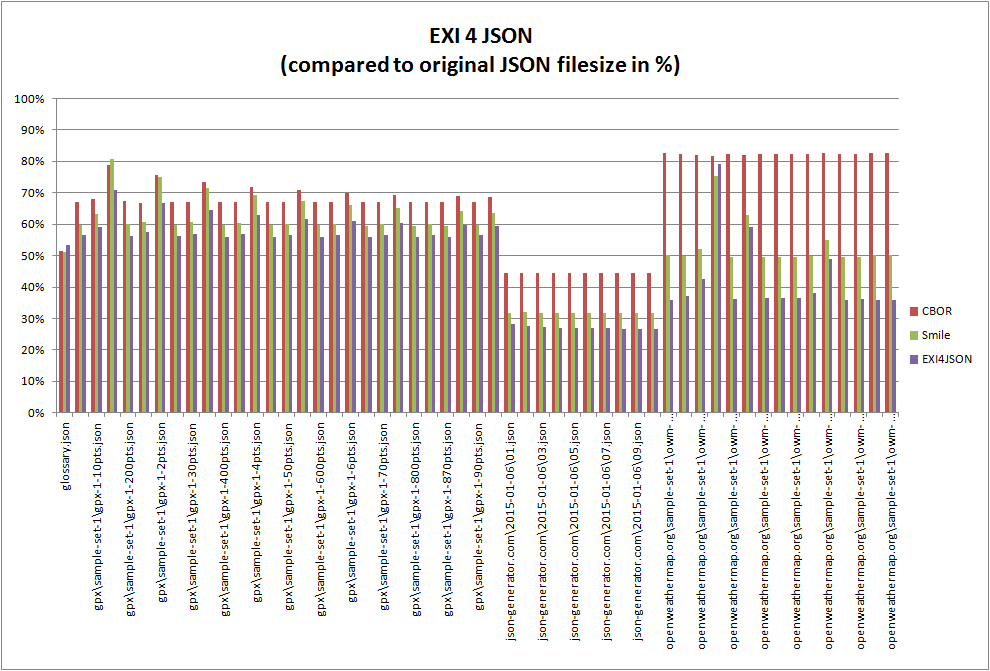

# Overview 

**_exificient-for-json_** is an implementation of the EXI4JSON specification (see <https://www.w3.org/TR/exi-for-json/>). EXI4JSON converts JSON to event streams which result in a very processing efficient and compact format. Lossless round-trip conversion back to the original JSON structures is supported. EXI4JSON is based on [EXI](https://www.w3.org/TR/exi/) and uses its [built-in datatypes](https://www.w3.org/TR/exi/#encodingDatatypes).

The project uses MIT license.

[](https://travis-ci.org/EXIficient/exificient-for-json)


## Background

Due to its EXI/XML nature EXI4JSON can be serialized/visualized as XML. Most of the use-case do not need this features but in some situation it may turn out very hand.

A JSON example 
```
{
  "keyNumber": 123,
  "keyArrayStrings": [
    "s1",
    "s2"
  ]
}
```

can be transformed to 

```
<j:map xmlns:j="http://www.w3.org/2015/EXI/json">
  <j:keyNumber>
    <j:number>123</j:number>
  </j:keyNumber>
  <j:keyArrayStrings>
    <j:array>
      <j:string>s1</j:string>
      <j:string>s2</j:string>
    </j:array>
  </j:keyArrayStrings>
</j:map>
```


## How to get it

Released with Maven

```
<dependency>
    <groupId>com.siemens.ct.exi</groupId>
    <artifactId>exificient-for-json</artifactId>
    <version>0.9.6</version>
</dependency>
```

or also as snapshot.

```
<dependency>
    <groupId>com.siemens.ct.exi</groupId>
    <artifactId>exificient-for-json</artifactId>
    <version>0.9.7-SNAPSHOT</version>
</dependency>
```

## How to use the library

### Java API for JSON Processing

```java
// generate by simply providing input and output
EXIforJSONGenerator e4jGenerator = new EXIforJSONGenerator();
e4jGenerator.generate(isJSON, osEXI4JSON);
// Note: one can also fire events like writeStartObject(),  writeKeyName(key) etc

// parse by simply providing input and output again
EXIforJSONParser e4jParser = new EXIforJSONParser();
e4jParser.parse(isEXI4JSON, osJSON);
// Note: one can again read events also fire events by readNextEvent() and getKeyName(),  getValueString() etc
```

### [Jackson](https://github.com/FasterXML) 

```java
EXI4JSONFactory fEXI = new EXI4JSONFactory();
ObjectMapper mapperEXI = new ObjectMapper(fEXI);
ObjectMapper mapperJSON = new ObjectMapper();

String carJson =
    "{ \"brand\" : \"Mercedes\", \"doors\" : 5 }";
JsonNode car = mapperJSON.readTree(carJson); 

// generate
OutputStream e4jOS = ...; // output stream
mapperEXI.writeTree(fEXI.createGenerator(e4jOS), car);
// parse
OutputStream e4jIS = ...; // input stream
EXI4JSONParser eparser = fEXI.createParser(e4jIS);
JsonNode carAgain = mapperJSON.readTree(eparser);
```


## Compression Results

See test-data in https://github.com/EXIficient/exificient-for-json/tree/master/src/test/resources.

| TestCase                                              |       JSON [Size in Bytes] |      CBOR [Size in Bytes] |  EXI4JSON [Size in Bytes] |
|-------------------------------------------------------|-----------:|----------:|----------:|
| glossary.json                                         |        605 |       311 |       322 |
| gpx\sample-set-1\gpx-1-100pts.json                    |     11.007 |     7.378 |     6.210 |
| gpx\sample-set-1\gpx-1-10pts.json                     |      1.318 |       898 |       778 |
| gpx\sample-set-1\gpx-1-1pts.json                      |        314 |       248 |       223 |
| gpx\sample-set-1\gpx-1-200pts.json                    |     21.661 |    14.578 |    12.179 |
| gpx\sample-set-1\gpx-1-20pts.json                     |      2.424 |     1.618 |     1.395 |
| gpx\sample-set-1\gpx-1-2pts.json                      |        426 |       322 |       284 |
| gpx\sample-set-1\gpx-1-300pts.json                    |     32.452 |    21.778 |    18.216 |
| gpx\sample-set-1\gpx-1-30pts.json                     |      3.480 |     2.338 |     1.984 |
| gpx\sample-set-1\gpx-1-3pts.json                      |        537 |       394 |       346 |
| gpx\sample-set-1\gpx-1-400pts.json                    |     43.257 |    28.978 |    24.239 |
| gpx\sample-set-1\gpx-1-40pts.json                     |      4.562 |     3.058 |     2.588 |
| gpx\sample-set-1\gpx-1-4pts.json                      |        648 |       466 |       408 |
| gpx\sample-set-1\gpx-1-500pts.json                    |     53.988 |    36.178 |    30.256 |
| gpx\sample-set-1\gpx-1-50pts.json                     |      5.634 |     3.778 |     3.191 |
| gpx\sample-set-1\gpx-1-5pts.json                      |        760 |       538 |       469 |
| gpx\sample-set-1\gpx-1-600pts.json                    |     64.758 |    43.378 |    36.284 |
| gpx\sample-set-1\gpx-1-60pts.json                     |      6.720 |     4.498 |     3.801 |
| gpx\sample-set-1\gpx-1-6pts.json                      |        872 |       610 |       531 |
| gpx\sample-set-1\gpx-1-700pts.json                    |     75.518 |    50.578 |    42.285 |
| gpx\sample-set-1\gpx-1-70pts.json                     |      7.778 |     5.218 |     4.396 |
| gpx\sample-set-1\gpx-1-7pts.json                      |        983 |       682 |       593 |
| gpx\sample-set-1\gpx-1-800pts.json                    |     86.292 |    57.778 |    48.293 |
| gpx\sample-set-1\gpx-1-80pts.json                     |      8.859 |     5.938 |     5.000 |
| gpx\sample-set-1\gpx-1-870pts.json                    |     93.786 |    62.818 |    52.476 |
| gpx\sample-set-1\gpx-1-8pts.json                      |      1.094 |       754 |       655 |
| gpx\sample-set-1\gpx-1-90pts.json                     |      9.942 |     6.658 |     5.609 |
| gpx\sample-set-1\gpx-1-9pts.json                      |      1.206 |       826 |       716 |
| json-generator.com\2015-01-06\01.json                 |  1.103.353 |   490.133 |   310.012 |
| json-generator.com\2015-01-06\02.json                 |  2.203.693 |   979.469 |   606.056 |
| json-generator.com\2015-01-06\03.json                 |  3.238.056 | 1.438.370 |   881.484 |
| json-generator.com\2015-01-06\04.json                 |  4.320.187 | 1.918.771 | 1.168.143 |
| json-generator.com\2015-01-06\05.json                 |  5.425.885 | 2.409.849 | 1.461.451 |
| json-generator.com\2015-01-06\06.json                 |  6.509.681 | 2.890.828 | 1.749.445 |
| json-generator.com\2015-01-06\07.json                 |  7.620.054 | 3.383.755 | 2.044.025 |
| json-generator.com\2015-01-06\08.json                 |  8.880.856 | 3.943.588 | 2.379.084 |
| json-generator.com\2015-01-06\09.json                 |  9.982.416 | 4.433.013 | 2.672.229 |
| json-generator.com\2015-01-06\10.json                 | 11.080.993 | 4.920.626 | 2.965.358 |
| openweathermap.org\sample-set-1\owm-1-1000cities.json |    622.540 |   514.167 |   223.442 |
| openweathermap.org\sample-set-1\owm-1-100cities.json  |     62.024 |    51.074 |    23.032 |
| openweathermap.org\sample-set-1\owm-1-10cities.json   |      6.170 |     5.069 |     2.629 |
| openweathermap.org\sample-set-1\owm-1-1cities.json    |        615 |       502 |       486 |
| openweathermap.org\sample-set-1\owm-1-200cities.json  |    123.811 |   101.857 |    44.954 |
| openweathermap.org\sample-set-1\owm-1-2cities.json    |      1.231 |     1.011 |       726 |
| openweathermap.org\sample-set-1\owm-1-300cities.json  |    185.699 |   152.787 |    67.573 |
| openweathermap.org\sample-set-1\owm-1-400cities.json  |    247.718 |   203.877 |    90.258 |
| openweathermap.org\sample-set-1\owm-1-500cities.json  |    309.532 |   254.791 |   112.848 |
| openweathermap.org\sample-set-1\owm-1-50cities.json   |     31.048 |    25.557 |    11.820 |
| openweathermap.org\sample-set-1\owm-1-5cities.json    |      3.136 |     2.587 |     1.535 |
| openweathermap.org\sample-set-1\owm-1-600cities.json  |    371.839 |   306.314 |   133.633 |
| openweathermap.org\sample-set-1\owm-1-700cities.json  |    433.746 |   357.313 |   156.390 |
| openweathermap.org\sample-set-1\owm-1-800cities.json  |    498.084 |   411.365 |   179.022 |
| openweathermap.org\sample-set-1\owm-1-900cities.json  |    560.315 |   462.826 |   201.229 |

On average "EXI4JSON" is about 48% of the original JSON filesize!
On average "EXI4JSON" is about 50% smaller than the CBOR binary encoded file!


